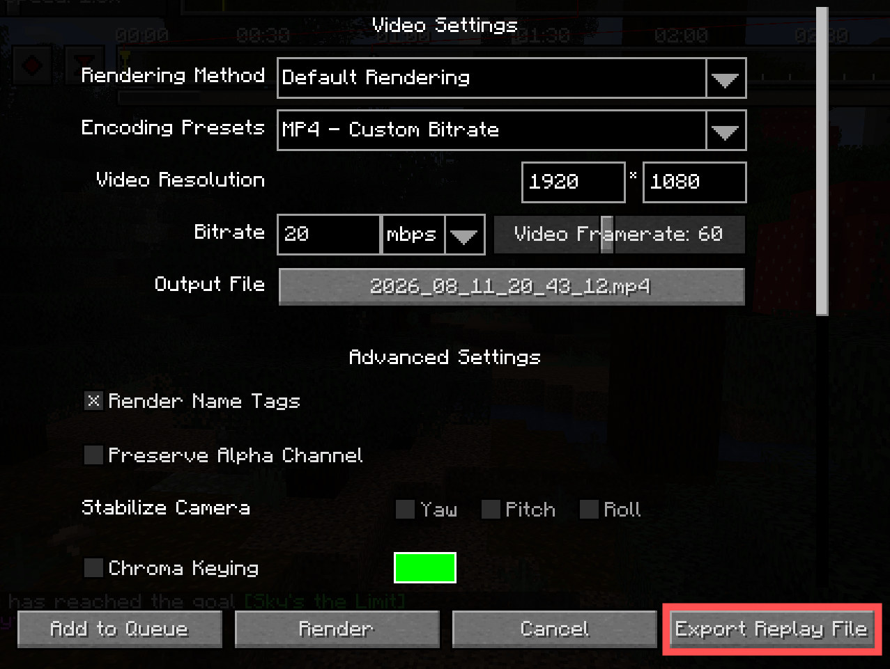
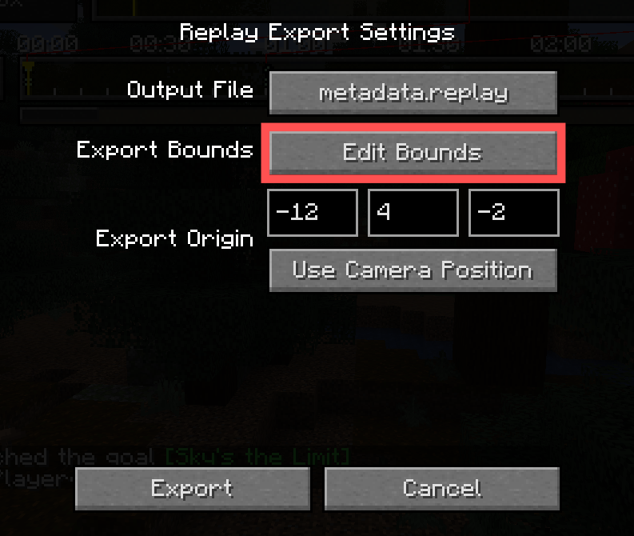
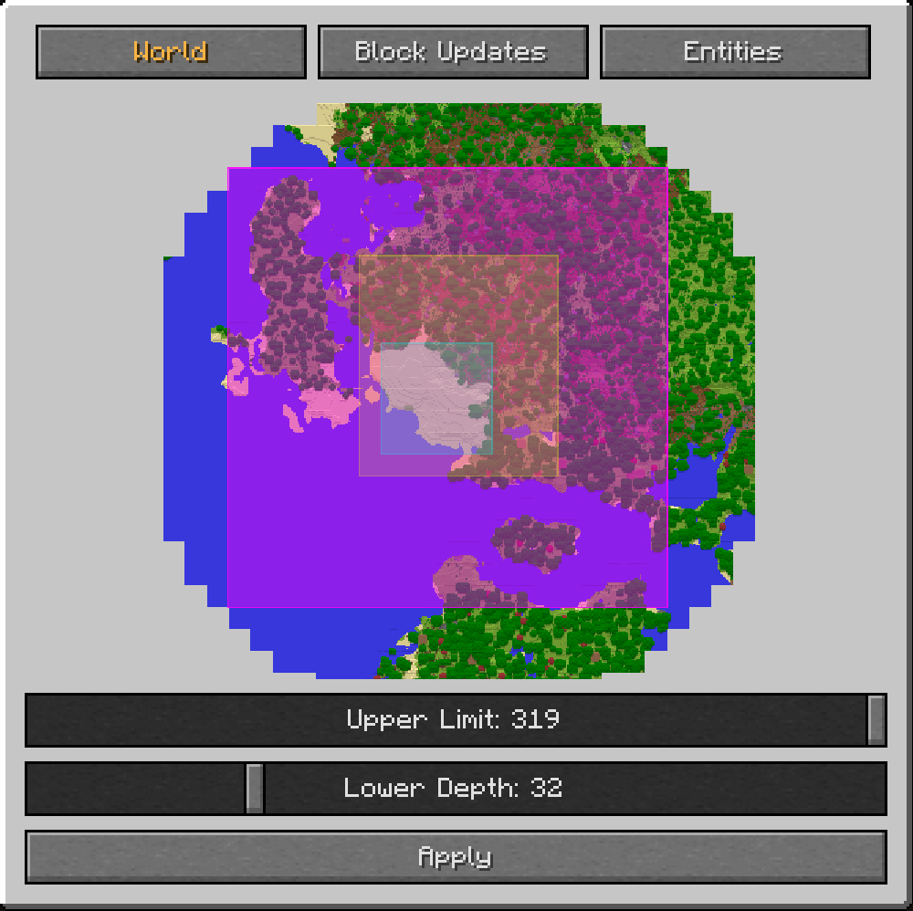
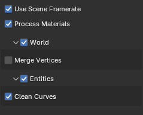

# Igrium's Replay Exporter

An addon for the [Replay Mod](https://www.replaymod.com/) that allows you to export your replays
into [Blender](https://www.blender.org/).

**This mod is designed for experienced Blender users!** It is designed to export your Minecraft scene, and nothing more.

**[Example](https://youtu.be/eDdBe3me0es)**

# Usage

## Exporting

To begin, open Minecraft and record the replay you wish to export. If you don't know how to do that, this mod is not for
you. Then, open the replay editor and add at least two time and camera keyframes. These will determine the start and end
points of your animation.

> Warning: nether portals and other forms of cross-dimension travel are not supported. Use multiple exports you intend
> on doing that.

Once you're happy with your replay, open the render screen and click "Export Replay File":

This will open a screen for you to select an output file and configure some replay settings. Adjust
your bounds to be as tight as possible. Raise the lower depth as high as it will go before it cuts off the visible
landscape, and reduce the perimeter depending on your planned shot.

The "Block Updates" and "Entities" regions add significantly more overhead than the "World" region, so it's recommended
to
tighten those even further.

## Importing

After exporting from Minecraft, you should be left with a `.replay` file, which can be imported into Blender using the
provided addon.

Once you've ensured the addon is installed, create a new project and go to
`File > Import > Minecraft Replay File (.replay)`. Navigate to your file, but before you import it, note the settings on
the right:

The main two you need to worry about are `World` and `Entities`. While you usually want to import both,
they each can take quite a bit of time, so it may be useful to disable one or the other.

Everything else can be left as default.

Once you're ready, click "Import Minecraft Replay" at the bottom. Blender will appear to hang for a few minutes. Don't
worry; this is because the contents of a Minecraft world is quite large, and Blender provides no (reliable) way to
update the UI while it is processing. (It might do to enable the system console to monitor progress.)

Once it is finished importing, you should have a Minecraft world and most of its entities in your scene! If something
goes wrong, make sure to submit a bug report!

# Contributing

Replay Exporter is a Fabric mod, so building it follows the same basic principles as any other mod (which will not be
reiterated here). However, due to it's nature as a "companion mod", Replay Exporter ships with slightly more complex
build features than others.

## Mod Integrations

Mod integrations are split into separate source sets: `main` holds only the common code for encoding replay animations,
and `replaymod` is responsible for actually triggering the export process while using Replay Mod. This is intended to
support for other mods such as Flashback and ReplayLab in the future, but only Replay Mod is implemented for now.

This segregation of disciplines ensures that no code dependencies from integrations find their way into contexts where
the target mod might not be present. If you were to try and depend on code from Replay Mod (or anything from the
`replaymod` source set) in `main`, you would get a compile error. However, this is purely a compile-time construct. At
runtime, Replay Exporter is still packaged as a singular mod, avoiding code-paths depending on mods that are not
present.

## Debugger

The exception to this is the `debugger` source set:

`debugger` is a separate "test" mod which provides an imgui-based UI for inspecting exported replay files. This is
useful for debugging entity model adapters, but it's not of any concern to the average user, so that code isn't shipped
with the full build.

Keep in mind that the debugger isn't exactly the *cleanest* code. It relies on native libraries that might be fragile
across different operating systems, and as a niche development tool, maintaining it not a priority.

It can be launched with `./gradlew runDebuggerClient`

## Blender Addon

Version 2 of the addon is structured very differently than Version 1. The primary change is the addition of a
`prefabs.blend` file.

Unlike the first version, which generated all its shaders in code, the new version includes a number of manually-created
assets that get appended as needed. This makes it much easier to ship stock effects such as enchantment glints, as the
node-tree can be created using the Blender interface, rather than having to do it in code.

`./gradlew buildAddon` will compile the addon into a zip and place it in `build/libs`, updating the version tag to
whatever is defined in `gradle.properties`. Note that this requires Blender in your PATH, for that's what's used to
build the extension.

The addon is slated to support Blender `4.4 - Current`. **Do *not* save the prefabs file in any version newer than 4.4!**

