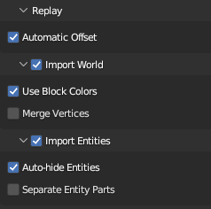

# Minecraft Replay Exporter

An addon for the [Replay Mod](https://www.replaymod.com/) that allows you to export your replays into [Blender](https://www.blender.org/).

**This mod is still in development. It is buggy and should not be used in a production environment!** (If you do use it in production, let me know how it goes!)

**[Example](https://youtu.be/eDdBe3me0es)**

# Installation

**Minecraft**

1. Download the jar file from the Releases tab.
2. Add the jar to your `mods` folder, alongside the Replay Mod and the Fabric API.

**Blender**

1. Download the zip file from the Releases tab. *Do not extract it!*
2. In Blender, open your preferences and go to the Add-ons tab.
3. In the top right, click "Install..." and navigate to the zip file in the window that opens.

# Usage

## Exporting

To begin, open Minecraft and record the replay you wish to export. If you don't know how to do that, you shouldn't be using this mod. Then, open the replay editor and add at least two time and camera keyframes. These will determine the start and end points of your animation.

> Warning: nether portals and other forms of cross-dimension travel are not currently supported.

Once you're happy with your replay, open the render screen click "Export replay file:"

This will open a screen for you to select an output file and configure some replay settings. At the time of writing, the available settings are:

- `Radius`: The number of chunks around the camera to export.

- `Lower Depth`: The Y value at which to cut off exporting.

Blocks are quite expensive to import and export, and your export region will *significantly* impact how long the file takes to process. It is recommended to determine the bare minimum of what must be exported in your scene and clamp your export bounds to that.

Once you're ready, click the "Export" button at the bottom left and wait for it to complete. It is common for the window to appear frozen while the initial block world is captured.

## Importing

After exporting from Minecraft, you should be left with a `.replay` file, which can be imported into Blender using the provided addon.

Once you've ensured the addon is installed, create a new project and go to `File > Import > Minecraft Replay File (.replay)`. Navigate to your file, but before you import it, see the settings on the right:

The main two you need to worry about are `Import World` and `Import Entities`. While you usually want to import both, they each can take quite a bit of time, so it may be useful to disable one or the other.

Everything else can be left as default.

Once you're ready, click "Import Minecraft Replay" at the bottom. Blender will appear to hang for a few minutes. Don't worry; this is because the data-set of a Minecraft world is quite large, and Blender provides no way to update the UI while it is processing.

Once it is finished importing, you should have a Minecraft world and most of its entities in your scene! If something goes wrong, make sure to submit a bug report!
