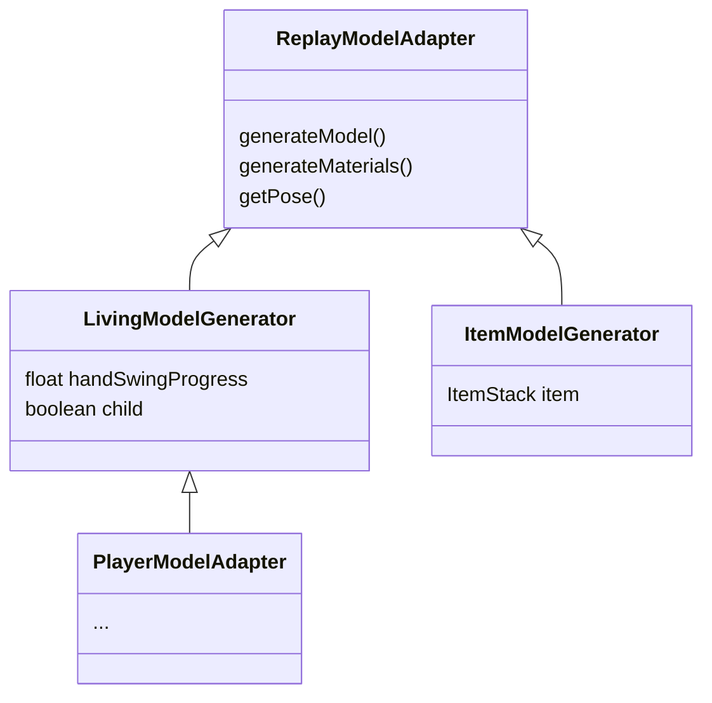
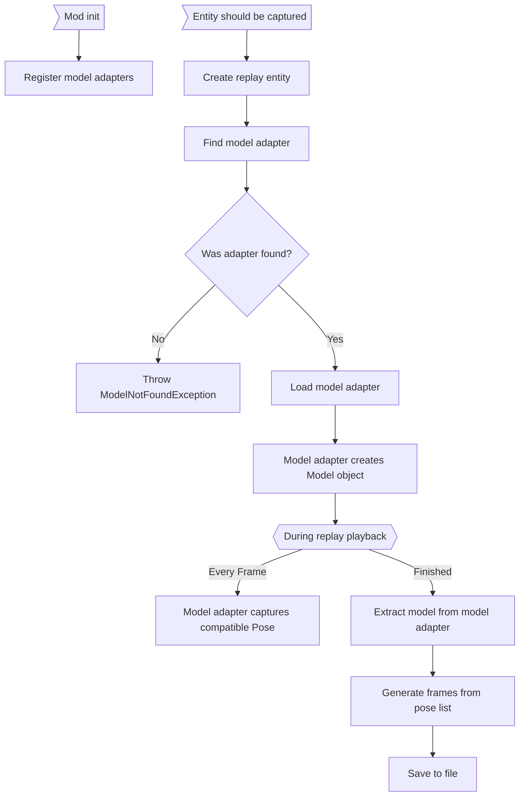

# Exporting Entities into a Standard 3D format

## Model Adapters

Minecraft's entity rendering system is interesting, to say the least. Unlike blocks, where there is a standard block-model format, each entity in Minecraft individually supplies a renderer which writes directly to viewport vertex buffers. This presents an interesting problem when trying to extract these entity models for use in a more general 3D package.

The solution to this problem is to, on a per-entity basis, supply a *model adapter*, which handles the creation of a *replay model* depending on how that entity's renderer is implemented. *How* a model adapter interfaces with an entity is implementation-dependent. For example, some model adapters may query an entity's native renderer, while others may construct a mesh from scratch. It may help to think of them as entity renderers specifically for export.

When the mod is loaded, model adapter factories are registered for each entity identifier, and when a replay is exported, a model adapter will be spawned for every entity in the map. Model adapters are loaded on a per-entity basis instead of a per-class basis like entity renderers because they may need to store internal values which are normally stored in the entity itself. The actual class of the model adapter varies per-entity, but they all implement `ReplayModelAdapter`.

> Note: Minecraft's entity renderers make extensive use of polymorphism to re-use code for similar types of entities. Entity model adapters make use of a similar polymorphism structure to re-use code. For instance, there is a parent class, `LivingModelGenerator`, that handles all entities that use `LivingEntityRenderer`s.

## Models

The replay file specification contains support for two different model types: `armature` and `multipart`. This is reflected in code with the `ReplayModel` interface and its subtypes, `ArmatureReplayModel` and `MultipartReplayModel`. These models are supplied and written to by the model adapter, and are responsible for serializing data into the `<model>` tag of of the entity xml file and managing bone coordinate spaces. Models may specify bones using whatever data structure they want. For instance, `armature`'s bind-pose-based system requires its `Bone` class must keep track of it's basis transform, whereas `multipart` can use simple strings to keep track of bones because they don't have more data to store. (This is why `ReplayModel` and `Pose` both use generics.)

There are a few major limitations however. The primary one is that the order in which bones are defined should be deterministic. That is, bones must be provided (and potentially stored) in a consistent order that won't change unless the model itself is changed. (No sets here!). Additionally, although bones can store any additional metadata they want, they must be able to have their transform represented with a traditional location, rotation, and scale. Both of these limitations are due to the fact that the format in which animations are defined in Replay files is *not* determined by the model type, and the only thing that changes accordingly is the coordinate space of the transforms.

## Replay Entities

Finally, there is the `ReplayEntity` class. With no direct subclasses, this entity's goal is simply to manage the higher level elements of the entity capture. It's responsible for creating the model adapter, telling the model adapter *when* to capture the entity pose, and saving the entity's XML data.

## Export process

 
